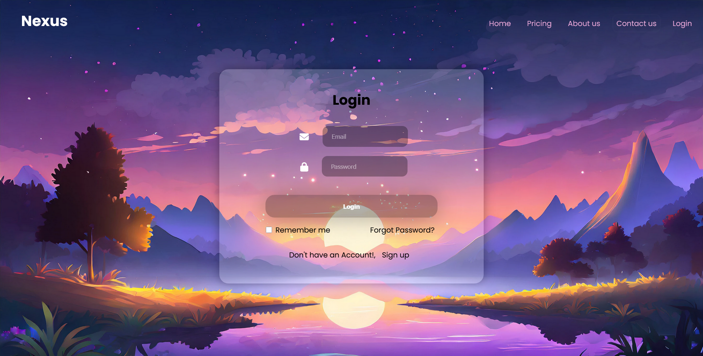

# 🌐 Nexus - Login Page 🔐

Welcome to the **Nexus Login Page**, the gateway to a clean, modern, and aesthetic authentication experience built using HTML, CSS, and Font Awesome. Whether it's a travel platform or your next web app startup — this is where security meets ✨style✨.

---

## 🚀 About This Project

The **Nexus Login Page** is a sleek and responsive login interface built as part of the *Nexus Travel* platform series. Designed with simplicity and style in mind, this page gives users a clean entry point to log in securely — without compromising aesthetics or usability.

> Yeah, it’s *just a login page*…  
> But this ain’t your average “username & password” scene. It’s a vibe.

---

## ✨ Features

- 📧 Email input field with icons  
- 🔒 Password input with lock icon  
- 📝 "Remember Me" checkbox  
- 🤕 Forgot password link  
- 💅 Font Awesome integration  

---

## 🛠️ Tech Stack

- HTML5  
- CSS3  
- Font Awesome  

---

## 📸 Preview

 

---

### 🎥 Project Demo

Check out the working demo of the Nexus Login Page in action:

[](https://youtu.be/Rfm3pEx2K6Q)

> Login page with HTML & CSS | Clean UI | Responsive design | Late night grind vibes 😤

---

## 🔗 Live Demo

👉 [Click here to view the live demo](https://rakesh12531.github.io/loginpage-project/)

---

## 📁 Folder Structure

```
/nexus-login
│
├── index.html
├── style.css
└── /assets
└── (images/icons/fonts etc.)
```
---

## 📌 Usage

Feel free to use this login page in:
- Portfolio projects  
- Web development practice  
- Landing pages needing authentication UI  

---

## 🤝 Let's Connect

If you're vibin’ with this project and want to collab, just scream “Yeager” in your mind and hit me up:  
📧 **rakeshraj12531@gmail.com**  
🔗 [LinkedIn](https://www.linkedin.com/in/rakesh531)  
🐙 [More Projects on GitHub](https://github.com/Rakesh12531)

---
